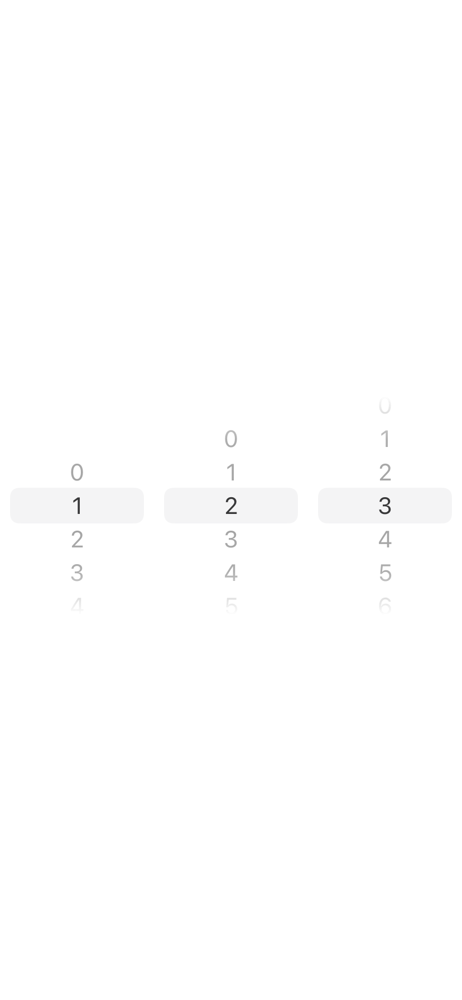
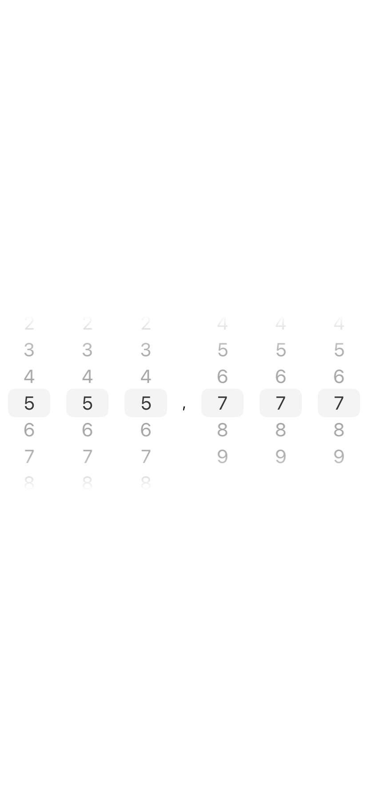

# NumberWheelPicker

NumberWheelPicker is a Swift package that provides two simple and customizable components for making it easy for users to input whole or decimal numbers.

## Features
- Built using native SwiftUI components
- Fully compatible with light and dark mode
- Customizable number of digits for whole and fractional parts
- Preselected values
- Compatible with iOS 14 and above

Here are images from both pickers (note that they were recorded with a black background during snapshot testing, but they blend in with no issues in the real UI).
| `WholeNumberWheelPicker` | `DecimalNumberWheelPicker` |
| - | - |
|  |  |

## Installation
### Swift Package Manager
- In Xcode, select “File” → “Add Packages...”
- Enter `git@github.com:kublaios/NumberWheelPicker.git`

...or you can add the following dependency to your Package.swift:
```
.package(url: "git@github.com:kublaios/NumberWheelPicker.git", from: "0.0.1")
```

### Manually
Add `WholeNumberWheelPicker.swift` file to your project. If you want the decimal picker, add `DecimalNumberWheelPicker.swift`, too.

## Usage
If you installed using SPM, make sure to import the package first:
```
import NumberWheeelPicker
```

Then, you should be able to create either of the pickers like below:
```
let wholeNumberPicker = WholeNumberWheelPicker(viewModel: .init(length: 3, preselectedValue: 123))
let decimalNumberPicker = DecimalNumberWheelPicker(viewModel: .init(preselectedValue: 555.777, wholeParthLength: 3, fractionalPartLength: 3))
```

### Customization
You can customize the appearance of both number pickers simply by changing the view model's properties.

For example, to set a custom delimiter between the whole and fractional parts:
```
decimalNumberPickerViewModel.delimiter = ","
```

## Contribution
Feel free to open issues or pull request for improvements or bug fixes. Please make sure that your code passes all current tests and lint requirements (TODO).

## License
This project is released under the MIT license. See [LICENSE](LICENSE) for details.
